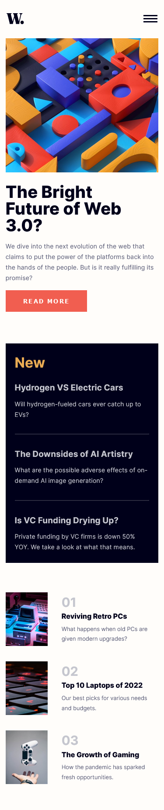
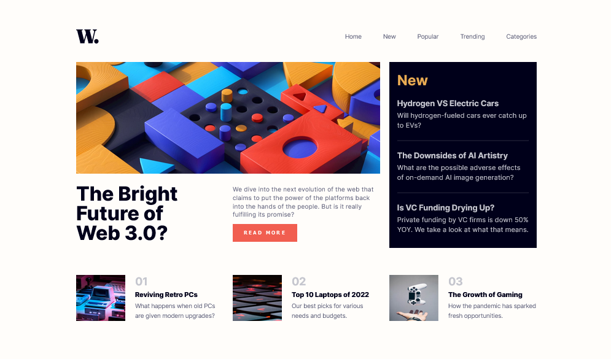
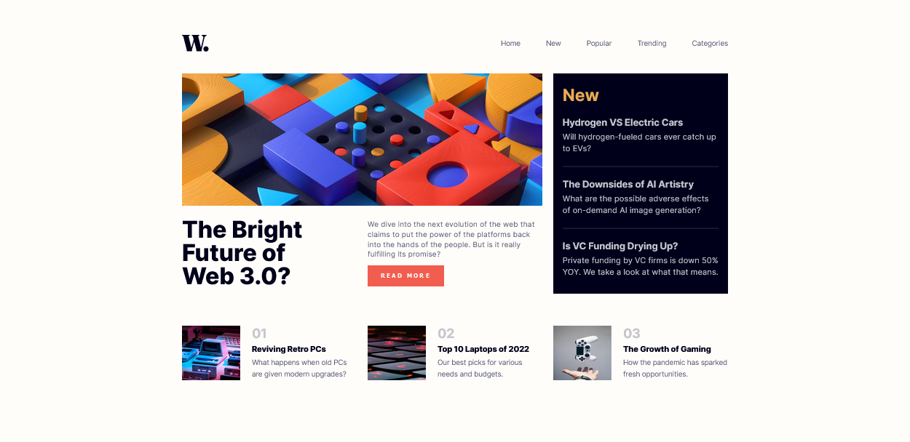

# Frontend Mentor - News homepage solution

This is a solution to the [News homepage challenge on Frontend Mentor](https://www.frontendmentor.io/challenges/news-homepage-H6SWTa1MFl). Frontend Mentor challenges help you improve your coding skills by building realistic projects. 

## Table of contents

- [Overview](#overview)
  - [The challenge](#the-challenge)
  - [Screenshot](#screenshot)
  - [Links](#links)
- [My process](#my-process)
  - [Built with](#built-with)
- [Author](#author)

## Overview

### The challenge

Users should be able to:

- View the optimal layout for the interface depending on their device's screen size
- See hover and focus states for all interactive elements on the page
- **Bonus**: Toggle the mobile menu (requires some JavaScript)

### Screenshot
- **MOBILE-RESPONSIVE**

- **TABLET-RESPONSIVE**

- **LAPTOP-RESPONSIVE**

- **DESKTOP RESPONSIVE**

### Links

- Solution URL: [Add solution URL here](https://www.frontendmentor.io/solutions/news-homepage-7OOsnyae5K)
- Live Site URL: [Add live site URL here](responsive-news-homepage-exhj6sc37-heion31.vercel.app)

## My process

### Built with

- Semantic HTML5 tags
- CSS Variables
- Flexbox
- Media Queries
- Keyframes
- Desktop-first workflow

## Author

- Frontend Mentor - [@heion31](https://www.frontendmentor.io/profile/yourusername)
- Twitter - [@heion31](https://www.twitter.com/yourusername)

